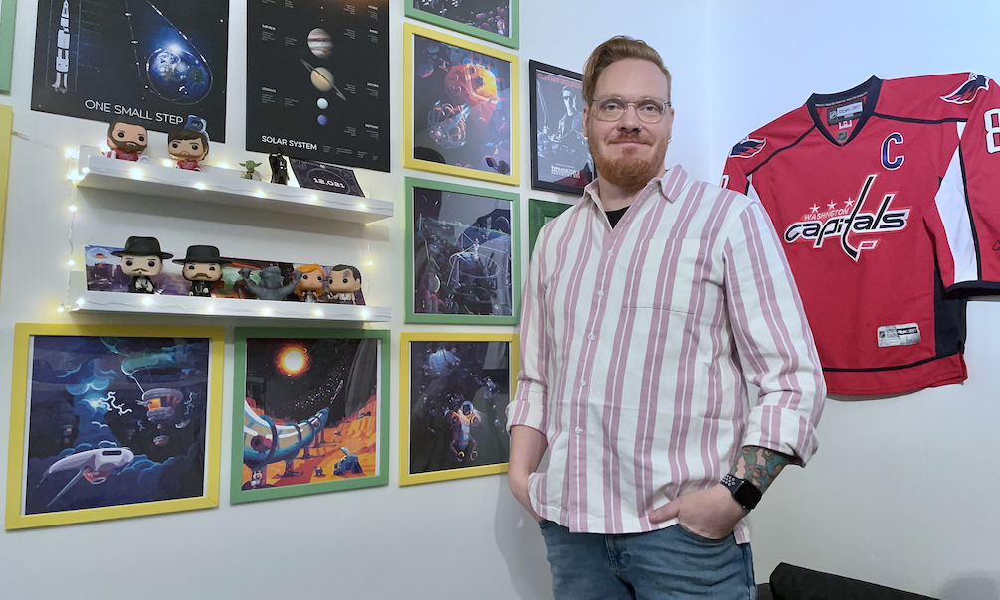

# Dennis Galvén

__Senior Fullstack Mobile Engineer__



```dart
// I smash keyboards until the computer complies/compiles.
```

## Contact

- **Email:** dennis@dennisaurus.dev
- **LinkedIn:** [linkedin.com/in/dennisaurus-rex](https://www.linkedin.com/in/dennisaurus-rex/)
- **GitHub:** [github.com/Dennisaurus-Rex](https://github.com/Dennisaurus-Rex)
- **Website:** [dennisaurus.dev](https://dennisaurus.dev)

## Summary

Senior mobile engineer with 8+ years of experience building native and cross-platform apps used by millions. Works across the stack — Swift, Kotlin, Flutter on the frontend, AWS, GCP, and Firebase on the backend. Has shipped in fintech (Swedbank, Walley), e-commerce (IKEA), proptech (Hemnet), sports tech (Spiideo), and media (HYPH). Happy to lead when needed, and genuinely enjoys mentoring and working on teams where people learn from each other.

***
<div style="page-break-after: always;"></div>

## Work Experience

### HYPH — Senior Mobile Engineer (2023 – Present)

Music creation app where users create, remix, and share songs.

- Full-stack mobile development across Flutter, native iOS, and native Android
- Step into AWS backend work when needed to support the music creation pipeline
- Bridge Flutter and native platform layers for audio and media features
- Set up and maintain the CI/CD pipeline with GitHub Actions

### Strafe — Mobile Engineer, Consultant (2023)

Companion app for competitive gaming and esports coverage.

- Built native iOS and Android features for live match tracking and tournament coverage

### OhCleo — Mobile Engineer, Consultant (2023)

Platform for user-created spoken novels.

- Brought in to diagnose and fix severe UI jitter and performance issues in the Flutter app
- Mentored junior developers on Flutter best practices and sustainable architecture going forward

### Hemnet — Mobile Engineer, Consultant (2022–2023)

Sweden's largest real estate platform.

- Worked on the native iOS app — large codebase, millions of users

### Spiideo — Mobile Engineer, Consultant (2022)

AI-powered sports video platform used by professional athletes and teams.

- Built native iOS features for camera control and video review
- Integrated with proprietary AI camera hardware

### Walley — Mobile Engineer, Consultant (2021)

Consumer financing app.

- Built and maintained features across native iOS and Android in a regulated fintech environment
- Worked on CI/CD using Azure DevOps

### IKEA — Mobile Engineer / Interim Team Lead (2020–2021)

IKEA's flagship store app — e-commerce and in-store companion.

- Stepped in as interim team lead while continuing to ship native iOS features
- Split time between hands-on development and leading the mobile team
- Migrated CI/CD from Jenkins to GitHub Actions

### Playtech — Mobile Engineer / Team Lead (2018–2020)

Digital sportsbook and betting platform.

- Led a mobile team building native iOS and Android betting apps
- Owned the release cycle in a heavily regulated igaming environment

### Swedbank — Mobile Engineer (2017–2018)

One of Sweden's largest banks.

- Worked on the native iOS banking app in Objective-C

### Wellbefy — Mobile Engineer (2017)

Corporate wellness platform.

- Built native iOS (Swift) and Android apps from early stage — first professional mobile role

***
<div style="page-break-after: always;"></div>

## Skills

**Mobile:** Flutter (iOS, Android, Web) · Swift · SwiftUI · UIKit · Kotlin · Jetpack Compose · Objective-C · Java

**Backend & Cloud:** AWS · GCP · Firebase

**Languages:** Dart · Swift · Kotlin · TypeScript · JavaScript · Python · Shell

**CI/CD:** GitHub Actions · Azure DevOps · Bitrise · Jenkins

**Design:** Figma · Sketch · Zeplin

**Version Control:** Git · GitHub · Bitbucket · GitLab · Gerrit

**Project Management:** Jira · Trello
